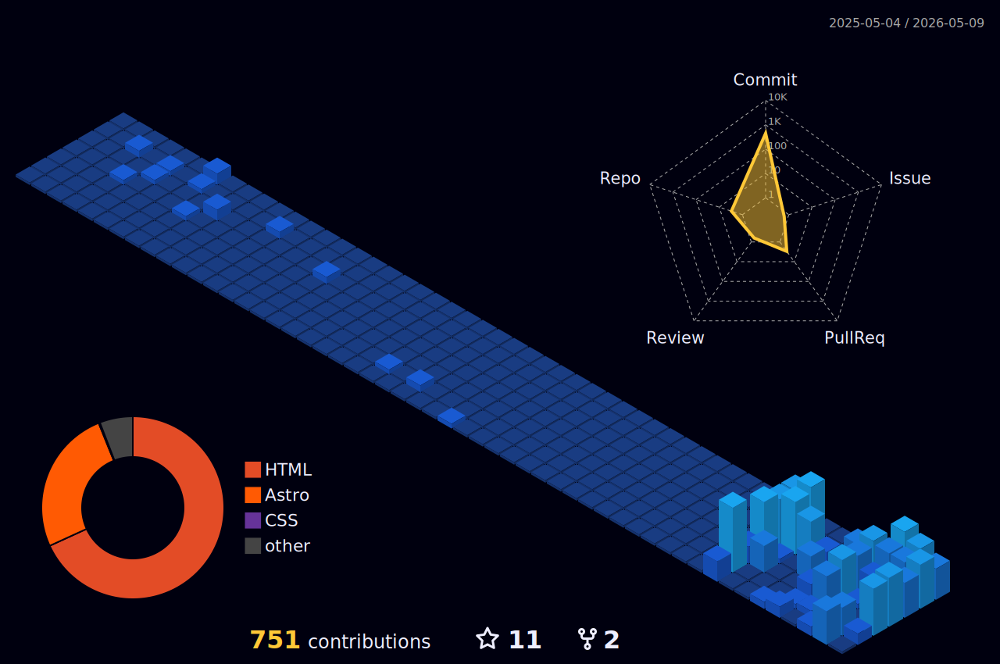

     <h1>Leandro Dukiévicz</h1>
      &ensp;&ensp;&ensp;&ensp;&ensp;&ensp;&ensp;&ensp;&ensp;&ensp;</a>&ensp;&ensp;&ensp;&ensp;&ensp;

#

_**<h2>Sobre:</h2>**_
### Olá, Seja bem vindo ao meu perfil 
  
  <li> Aficcionado por Programação, nerd 🤓, Músico por Hobbie, toco violão, guitarra e baixo 🎸 🎼,  Consumidor assíduo de café ☕, amante de boa música, Cinema, literatura e ficção científica 📖.</li>
       
 <li> Formado em <strong>Sistemas para Internet - Desenvolvimento Web - Full-Stack</strong> na <a href="https://www.unicesumar.edu.br/" target="_blank" >Unicesumar </a>. em 26/01/2024 </li>
        
  <li>💻 Estudando atualmente : <a href="https://udemy.com.br" target="_blank">Cursos Udemy</a>&ensp;&ensp;&ensp;<a href="https://curso.dev/" target="_blank">Curso Dev do Filipe Deschamps</a>&ensp;&ensp;&ensp;<a href="https://formacaofullstackjavascript.club.hotmart.com/" target="_blank">Curso Full Stack Thiago Medeiros</a>&ensp;&ensp;&ensp;<a href="https://inscricoes.unicesumar.edu.br" target="_blank">Pós graduação em Python</a> </li> 
          
  <li>🔭 Atualmente estou em transição de carreira procurando por oportunidades em Front end, porém vale ressaltar que tenho excelentes noções com backend.</li>
          
   <li> Tenho Inglês básico ( em evolução para intermediário ) com ênfase em termos técnicos e vocabulário
relacionado à programação. Suficiente para comunicação efetiva no ambiente de
desenvolvimento de software.</li>
        
<li>💻 Confira meu <strong><i>Portifólio</i></strong> atual  <a href="https://leandroduk.vercel.app/" target="_blank">Clicando Aqui !!</a> </li> 
 
  </ul>
 
    

    

   

 

 #
      
<section align="center">
  <h2 align="center"> Informações do Perfil:</h2>
  
</section>
       

|  |  |  |
| :-: | :-: | :-: |

#

    
   <a href="http://www.github.com/LeandroDukievicz"> 

#

### :fire:  Status :

#

<h1 align="center"> Atividade </h1>

#

 

 

      
  

<table align="center" border="10px" >
      <tr>
            <td></td> 
            <td>
Estou sempre me atualizando e aprendendo continuamente novas tecnologias,  e caso queira conferir um poucos dos cursos ao qual já concluí,  é so clicar ao lado, ou conferir os projetos de acordo com  a linguagem ou framework logo abaixo !
</td>
             <td><a href="https://github.com/LeandroDukievicz/CERTIFICATES"><i><strong>Confira Aqui!</i></strong></a></td> 
      </tr>
</table>

 

 

    
 Total visits on my profile :detective:

    
 

          
 #
 
 

     <a  href="https://github.com/LeandroDukievicz" target="_blank">

   

    
 
     

  

